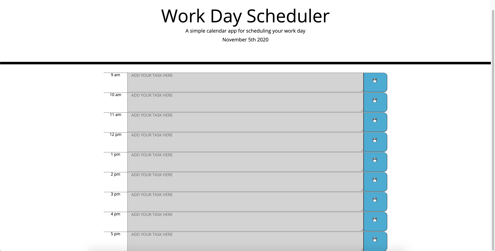

# Work Day Scheduler

## Decription

* GIVEN I am using a daily planner to create a schedule<br>
WHEN I open the planner<br>
THEN the current day is displayed at the top of the calendar<br>
WHEN I scroll down<br>
THEN I am presented with time blocks for standard business hours<br>
WHEN I view the time blocks for that day<br>
THEN each time block is color-coded to indicate whether it is in the past, present, or future<br>
WHEN I click into a time block<br>
THEN I can enter an event<br>
WHEN I click the save button for that time block<br>
THEN the text for that event is saved in local storage<br>
WHEN I refresh the page<br>
THEN the saved events persist
## Setup
```
git clone git@github.com:eramos3/work-day-scheduler.git
```
## Built With
* HTML
* CSS
* jQuery
* Moment
* Bootstrap

[working deployed link recording](https://drive.google.com/file/d/1EOW7LJnmPg-iMrf8xIdB7Y7jmGIC3Pvs/view)



[Work Day Scheduler page](https://eramos3.github.io/work-day-scheduler/)